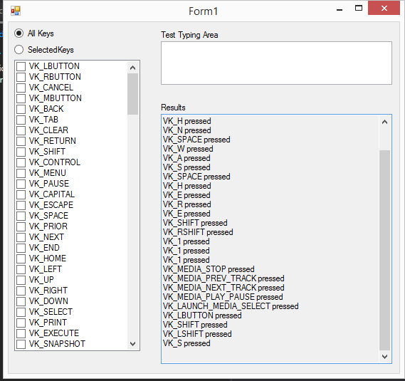

KeyboardListener
================

This is a simple API to get windows keyboard events in C#.  The sample application shows a basic usage of the API.  It is a Windows Forms application that allows you to see what data is being raised as keys are typed on the machine.

Using the API is as simple as:

    using System;
    using KeyboardListener;
  
    namespace ConsoleApplicationKeyboard
    {
        class Program
        {
            static void Main(string[] args)
            {
                Listener l = new Listener();
                l.AllKeys = true;
                l.KeyPressed += L_KeyPressed;
                l.Listen();
    
                Console.ReadLine();
    
                l.StopListening();
            }
    
            private static void L_KeyPressed(Keycode keycodes)
            {
                Console.WriteLine(keycodes);
            }
        }
    }
